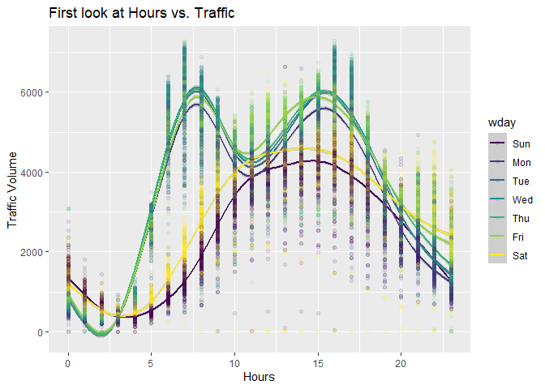

Traffic in Minneapolis
================

# Data Origin

This data originated from UCI’s Machine Learning Repository donated by
John Hogue. The data was collected on the busy Interstate 94 between
Minneapolis and St. Paul – a suburb or sibling-city of Minneapolis.

# Project Goals

The goal of this project was to build a few models to represent traffic
volume on this busy highway, particularly based on the hours of the day
and day of the week. I wanted to get healthy models built on just this
particular set of variables because I was hoping to isolate the affect
of Rain and Cloudiness on weather. In a future project I hope to
incorporate how heavy the rain is and how dense the clouds are to see if
that affects traffic volume more drastically.

# Load and explore data structure

    ## Rows: 48,204
    ## Columns: 9
    ## $ holiday             <chr> "None", "None", "None", "None", "None", "None", "N…
    ## $ temp                <dbl> 288.28, 289.36, 289.58, 290.13, 291.14, 291.72, 29…
    ## $ rain_1h             <dbl> 0, 0, 0, 0, 0, 0, 0, 0, 0, 0, 0, 0, 0, 0, 0, 0, 0,…
    ## $ snow_1h             <dbl> 0, 0, 0, 0, 0, 0, 0, 0, 0, 0, 0, 0, 0, 0, 0, 0, 0,…
    ## $ clouds_all          <int> 40, 75, 90, 90, 75, 1, 1, 1, 20, 20, 20, 1, 1, 1, …
    ## $ weather_main        <chr> "Clouds", "Clouds", "Clouds", "Clouds", "Clouds", …
    ## $ weather_description <chr> "scattered clouds", "broken clouds", "overcast clo…
    ## $ date_time           <chr> "2012-10-02 09:00:00", "2012-10-02 10:00:00", "201…
    ## $ traffic_volume      <int> 5545, 4516, 4767, 5026, 4918, 5181, 5584, 6015, 57…

# Data processing

I removed temperatures below Kelvin 230 due to Minneapolis/St Paul never
having recorded temperatures that low. I also removed any rain values
above 1 meter in 1 hour since there was only 1 case of that with a
recorded 100,000 millimeters in 1 hour. Obviously, this would be
impossible.

``` r
traffic = df %>% 
  mutate(
    date_time = as_datetime(date_time)) %>% 
  mutate(
    date = date(date_time),
    wday = wday(date_time, label = TRUE),
    hour = hour(date_time)) %>% 
  filter(
    rain_1h < 1000 & 
    temp > 230) %>%
  mutate(
    sinhour = sin(2 * pi * (hour + 5) / 24))

glimpse(traffic)
```

    ## Rows: 48,193
    ## Columns: 13
    ## $ holiday             <chr> "None", "None", "None", "None", "None", "None", "N…
    ## $ temp                <dbl> 288.28, 289.36, 289.58, 290.13, 291.14, 291.72, 29…
    ## $ rain_1h             <dbl> 0, 0, 0, 0, 0, 0, 0, 0, 0, 0, 0, 0, 0, 0, 0, 0, 0,…
    ## $ snow_1h             <dbl> 0, 0, 0, 0, 0, 0, 0, 0, 0, 0, 0, 0, 0, 0, 0, 0, 0,…
    ## $ clouds_all          <int> 40, 75, 90, 90, 75, 1, 1, 1, 20, 20, 20, 1, 1, 1, …
    ## $ weather_main        <chr> "Clouds", "Clouds", "Clouds", "Clouds", "Clouds", …
    ## $ weather_description <chr> "scattered clouds", "broken clouds", "overcast clo…
    ## $ date_time           <dttm> 2012-10-02 09:00:00, 2012-10-02 10:00:00, 2012-10…
    ## $ traffic_volume      <int> 5545, 4516, 4767, 5026, 4918, 5181, 5584, 6015, 57…
    ## $ date                <date> 2012-10-02, 2012-10-02, 2012-10-02, 2012-10-02, 2…
    ## $ wday                <ord> Tue, Tue, Tue, Tue, Tue, Tue, Tue, Tue, Tue, Tue, …
    ## $ hour                <int> 9, 10, 11, 12, 13, 14, 15, 16, 17, 18, 19, 20, 21,…
    ## $ sinhour             <dbl> -5.000000e-01, -7.071068e-01, -8.660254e-01, -9.65…

``` r
traffic_clouds = traffic %>%
  filter(weather_main == "Clouds")
traffic_rain = traffic %>%
  filter(weather_main == "Rain")
```

# Exploration of prediction variables

``` r
ggplot(traffic, aes(hour, traffic_volume, color = wday)) +
  geom_smooth() +
  geom_point(alpha = 0.1) +
  labs(title = "First look at Hours vs. Traffic",
       x = "Hours",
       y = "Traffic Volume")
```

<!-- -->

``` r
ggplot(traffic, aes(sinhour, traffic_volume, color = wday)) +
  geom_smooth() +
  geom_point(alpha = 0.1) +
  labs(title = "Hours vs. Traffic after using the sin function to linearize hours",
       x = "Sine of Hours",
       y = "Traffic Volume")
```

<!-- -->

``` r
ggplot(traffic, aes(x = weather_main, y = traffic_volume, color = weather_main)) +
  geom_boxplot() +
  labs(title = "Weather and Traffic",
       subtitle = "The goal of my project was to see if I could associate cloud cover and rain with less traffic volume",
       x = "Weather Type", 
       y = "Traffic Volume")
```

<!-- -->

# Hypothesis Testing

``` r
# Placeholder
t.test(traffic$traffic_volume, traffic_clouds$traffic_volume, alternative = "greater")
```

    ## 
    ##  Welch Two Sample t-test
    ## 
    ## data:  traffic$traffic_volume and traffic_clouds$traffic_volume
    ## t = -19.981, df = 26332, p-value = 1
    ## alternative hypothesis: true difference in means is greater than 0
    ## 95 percent confidence interval:
    ##  -387.7708       Inf
    ## sample estimates:
    ## mean of x mean of y 
    ##  3260.174  3618.450

``` r
t.test(traffic$traffic_volume, traffic_rain$traffic_volume, alternative = "greater")
```

    ## 
    ##  Welch Two Sample t-test
    ## 
    ## data:  traffic$traffic_volume and traffic_rain$traffic_volume
    ## t = -2.0601, df = 7078.2, p-value = 0.9803
    ## alternative hypothesis: true difference in means is greater than 0
    ## 95 percent confidence interval:
    ##  -103.1295       Inf
    ## sample estimates:
    ## mean of x mean of y 
    ##  3260.174  3317.515

# Split into train / test sets

``` r
traffic$id = 1:nrow(traffic)
traffic.train = traffic %>% sample_frac(0.70)
traffic.test = traffic %>% anti_join(traffic.train, by = "id")

"If these two values are the same, then the test + train correctly equals the original."
```

    ## [1] "If these two values are the same, then the test + train correctly equals the original."

``` r
nrow(traffic)
```

    ## [1] 48193

``` r
nrow(traffic.train) +
nrow(traffic.test)
```

    ## [1] 48193

# Train and test models

## Model 1

Poor R value, but all other metrics are significant. Traffic Volume \~
Hour

``` r
mod1 = lm(traffic_volume ~ hour, data = traffic.train)
summary(mod1)
```

    ## 
    ## Call:
    ## lm(formula = traffic_volume ~ hour, data = traffic.train)
    ## 
    ## Residuals:
    ##     Min      1Q  Median      3Q     Max 
    ## -4438.5 -1687.3   -34.7  1589.4  4443.5 
    ## 
    ## Coefficients:
    ##             Estimate Std. Error t value Pr(>|t|)    
    ## (Intercept)  2106.82      19.44  108.38   <2e-16 ***
    ## hour          101.38       1.46   69.46   <2e-16 ***
    ## ---
    ## Signif. codes:  0 '***' 0.001 '**' 0.01 '*' 0.05 '.' 0.1 ' ' 1
    ## 
    ## Residual standard error: 1858 on 33733 degrees of freedom
    ## Multiple R-squared:  0.1251, Adjusted R-squared:  0.1251 
    ## F-statistic:  4825 on 1 and 33733 DF,  p-value: < 2.2e-16

## Model 2

Great R Value, relates Traffic Volume \~ sin(hour) + weekday without
intercept

``` r
mod2 = lm(traffic_volume ~ sinhour + wday - 1, data = traffic.train)
summary(mod2)
```

    ## 
    ## Call:
    ## lm(formula = traffic_volume ~ sinhour + wday - 1, data = traffic.train)
    ## 
    ## Residuals:
    ##     Min      1Q  Median      3Q     Max 
    ## -5031.7  -808.8  -192.7   575.5  3772.9 
    ## 
    ## Coefficients:
    ##          Estimate Std. Error t value Pr(>|t|)    
    ## sinhour -2261.373      8.454  -267.5   <2e-16 ***
    ## wdaySun  2394.868     15.836   151.2   <2e-16 ***
    ## wdayMon  3309.127     15.577   212.4   <2e-16 ***
    ## wdayTue  3532.706     15.823   223.3   <2e-16 ***
    ## wdayWed  3605.271     15.730   229.2   <2e-16 ***
    ## wdayThu  3652.482     15.806   231.1   <2e-16 ***
    ## wdayFri  3686.352     15.851   232.6   <2e-16 ***
    ## wdaySat  2780.288     15.781   176.2   <2e-16 ***
    ## ---
    ## Signif. codes:  0 '***' 0.001 '**' 0.01 '*' 0.05 '.' 0.1 ' ' 1
    ## 
    ## Residual standard error: 1095 on 33727 degrees of freedom
    ## Multiple R-squared:  0.9178, Adjusted R-squared:  0.9177 
    ## F-statistic: 4.705e+04 on 8 and 33727 DF,  p-value: < 2.2e-16

# Model Performance Comparison

Here we have graphs that are well labeled to display what is going on
within them.

``` r
traffic.pred = traffic.test %>% 
  spread_residuals(mod1, mod2)

grid = traffic.test %>%
  data_grid(hour = 0:23, wday) %>%
  mutate(sinhour = sin(2 * pi * (hour + 5) / 24)) %>%
  spread_predictions(mod1, mod2) 

ggplot(traffic.pred, aes(hour, traffic_volume)) +
  geom_point(alpha = 0.1) +
  geom_smooth(se = FALSE) +
  geom_smooth(data = grid, aes(y = grid$mod1), color = "red", se = FALSE) +
  geom_smooth(data = grid, aes(y = grid$mod2), color = "hot pink", se = FALSE) +
  labs(title = "Comparing models to reality",
       subtitle = "Blue = original data, Red = Model 1 (linear), Pink = Model 2 (nonlinear)",
       x = "Hour",
       y = "Actual and Predicted Traffic")
```

    ## Warning: Use of `grid$mod1` is discouraged. Use `mod1` instead.

    ## Warning: Use of `grid$mod2` is discouraged. Use `mod2` instead.

<!-- -->

``` r
ggplot(traffic.pred, aes(hour, traffic_volume, color = wday)) +
  geom_point(alpha = 0.1) +
  geom_smooth(se = FALSE, size = 0.2) +
  geom_smooth(data = grid, aes(y = grid$mod1), color = "red", se = FALSE) +
  geom_smooth(data = grid, aes(y = grid$mod2), color = "hot pink", se = FALSE) +
  labs(title = "Comparing models with weekday separation",
       subtitle = "Blue = original data, Red = Model 1 (linear), Pink = Model 2 (nonlinear)",
       x = "Hour",
       y = "Actual and Predicted Traffic") +
  theme(legend.position = "bottom") +
  guides(color = (guide_legend(nrow = 1)))
```

    ## Warning: Use of `grid$mod1` is discouraged. Use `mod1` instead.
    ## Use of `grid$mod2` is discouraged. Use `mod2` instead.

<!-- -->

``` r
ggplot(traffic.pred, aes(hour, mod1)) +
  geom_smooth(color = "red") +
  geom_smooth(aes(y = mod2), color = "green") +
  geom_point(alpha = 0.1, color = "red") +
  geom_point(aes(y = mod2), alpha = 0.1, color = "green") +
  labs(title = "Residual Plot comparing both models",
       subtitle = "Red (linear), Green (nonlinear)",
       x = "Hour",
       y = "Traffic Volume Residuals")
```

<!-- -->

``` r
ggplot(traffic, aes(x = weather_main, y = traffic_volume, color = weather_main)) +
  geom_boxplot() +
  labs(title = "Old Weather and Traffic boxes",
       x = "Weather Type", 
       y = "Traffic Volume")
```

<!-- -->

``` r
ggplot(traffic.pred, aes(weather_main, mod1, color = weather_main)) + 
  geom_boxplot() +
  labs(title = "New weather boxes based on my linear model",
       x = "Weather",
       y = "Traffic Residuals")
```

<!-- -->

``` r
ggplot(traffic.pred, aes(weather_main, mod2, color = weather_main)) +
  geom_boxplot() +
  labs(title = "New weather boxes based on my nonlinear model",
       x = "Weather",
       y = "Traffic Residuals")
```

<!-- -->

# Final Test

``` r
traffic.pred.clouds = filter(traffic.pred, weather_main == "Clouds")
traffic.pred.rain = filter(traffic.pred, weather_main == "Rain")

t.test(traffic.pred$mod2, traffic.pred.clouds$mod2, alternative = "greater")
```

    ## 
    ##  Welch Two Sample t-test
    ## 
    ## data:  traffic.pred$mod2 and traffic.pred.clouds$mod2
    ## t = -3.1885, df = 7943.9, p-value = 0.9993
    ## alternative hypothesis: true difference in means is greater than 0
    ## 95 percent confidence interval:
    ##  -86.95053       Inf
    ## sample estimates:
    ## mean of x mean of y 
    ##  8.453792 65.811605

``` r
t.test(traffic.pred$mod2, traffic.pred.rain$mod2, alternative = "greater")
```

    ## 
    ##  Welch Two Sample t-test
    ## 
    ## data:  traffic.pred$mod2 and traffic.pred.rain$mod2
    ## t = -0.68644, df = 2045.1, p-value = 0.7537
    ## alternative hypothesis: true difference in means is greater than 0
    ## 95 percent confidence interval:
    ##  -66.39766       Inf
    ## sample estimates:
    ## mean of x mean of y 
    ##  8.453792 27.998067

# Analysis and Conclusions

Goal: show that Clouds or Rain has a negative effect on traffic volume
in highway traffic.

Analysis: First I did some data wrangling. Particularly, converting the
date-time which was stored in factor form to more appropriate values and
subsets (i.e. hours and wdays). After this, I tried to identify which
variables likely had the most massive effect on traffic on this
particular highway. I, of course, concluded that the hour of the day is
the foremost value in the data set, then quickly concluded that the wday
would be the second most important. Additionaly, I found that the curve
of hours as an effect on traffic volume looked suspiciously like a
double humped sin wave, so I modified the hours to reflect this possible
distribution. This seemed to make the data more linear, but not
necessarily perfectly. Either way, using these as my baseline for moving
into the models, I worked on making a linear model to decide traffic
volume simply by the hour of the day (univariate). Then, I used the
sin(hours) and weekday as my approace for the multivariate model. This
felt appropriate and it was immediately clear that the multivariate
model was better due to the correlation coefficient being so high.
Finding myself in a decent spot, I started to plot the residuals and was
somewhat satisfied with the distribution. Before all of the modeling I
found that I failed to reject the null hypotheses of rain and clouds
having the same mean as the full data set.

Conclusions: After working with my models and isolating the hour and
weekday variables out, I still wasn’t able to show that we could reject
the null hypotheses. So, after all of my hardwork, I found no way to
distinguish between these factors. After doing the project, I feel that
day time and night time would have been another route to isolating the
variable of weather. My hope was that my analysis on hours would have
worked, but I wasn’t able to prove anything definitively with the
approach I used to remove hours from the analysis.
